# ShareFile to Google Shared Drive - Included/Excluded Exhibits Implementation ✅

## Summary
Successfully implemented separate "Included" and "Excluded" exhibits for ShareFile to Google Shared Drive combination with automatic merge ordering.

## What Was Changed

### 1. Database Schema Updated ✅
**File:** `seed-exhibits.cjs`

Added two new exhibit entries with `exhibitType` field:
- `exhibit-sharefile-to-sharedrive-advanced-included.docx` → `exhibitType: 'included'`
- `exhibit-sharefile-to-sharedrive-advanced-not-included.docx` → `exhibitType: 'excluded'`

```javascript
{
  name: 'ShareFile to Google Shared Drive - Included Features',
  fileName: 'exhibit-sharefile-to-sharedrive-advanced-included.docx',
  combinations: ['sharefile-to-google-sharedrive'],
  category: 'content',
  exhibitType: 'included',  // NEW FIELD
  displayOrder: 1
},
{
  name: 'ShareFile to Google Shared Drive - Not Included Features',
  fileName: 'exhibit-sharefile-to-sharedrive-advanced-not-included.docx',
  combinations: ['sharefile-to-google-sharedrive'],
  category: 'content',
  exhibitType: 'excluded',  // NEW FIELD
  displayOrder: 2
}
```

### 2. TypeScript Interface Updated ✅
**File:** `src/components/ExhibitSelector.tsx`

Added `exhibitType` field to Exhibit interface:
```typescript
interface Exhibit {
  _id: string;
  name: string;
  description: string;
  fileName: string;
  combinations: string[];
  category?: string;
  exhibitType?: 'included' | 'excluded' | 'general';  // NEW
  isRequired: boolean;
  displayOrder: number;
}
```

### 3. Visual Badges Added ✅
**File:** `src/components/ExhibitSelector.tsx`

Added visual indicators in the UI:
- ✅ **Green badge** for "Included" exhibits: `✓ Included`
- ⊗ **Orange badge** for "Excluded" exhibits: `⊗ Not Included`

### 4. Merge Order Enforced ✅
**File:** `src/components/QuoteGenerator.tsx` (2 locations)

Updated both email generation (line ~1044) and download generation (line ~3278) to:
1. Fetch exhibit metadata from `/api/exhibits`
2. Sort by `exhibitType`: **Included → Excluded → General**
3. Merge in sorted order

Result: Final document always has the correct order:
```
📄 Main Template (Multi Combination)
📄 Included Exhibits (if selected)
📄 Excluded Exhibits (if selected)
📄 General Exhibits (if selected)
```

## Files Created

### Backend Exhibits (in `backend-exhibits/` folder)
✅ `exhibit-sharefile-to-sharedrive-advanced-included.docx` - Contains "INCLUDED FEATURES" table
✅ `exhibit-sharefile-to-sharedrive-advanced-not-included.docx` - Contains "NOT INCLUDED FEATURES" table

## ⚠️ Action Required

### 1. Fix File Name (Important!)
One file has a double extension that needs to be fixed:

**Current:** `exhibit-sharefile-to-sharedrive-advanced-included.docx.docx`
**Rename to:** `exhibit-sharefile-to-sharedrive-advanced-included.docx`

### 2. Restart Server & Seed Database
After fixing the file name, restart your backend server to seed the new exhibits:

```powershell
# Stop the current server (Ctrl+C)
# Then restart it
node server.cjs
```

The seed process will automatically:
- Detect the new exhibit files
- Add them to MongoDB with `exhibitType` field
- Make them available in the UI

### 3. Test the Feature

#### Step 1: Select Multi Combination
1. Open the application
2. Select **Migration Type** = "Multi combination"
3. Select **Combination** = "ShareFile to Google Shared Drive"

#### Step 2: Select Exhibits
You should see in the **CONTENT** column:
```
✅ ShareFile to Google Shared Drive - Included Features
   [Green badge: ✓ Included]

⊗ ShareFile to Google Shared Drive - Not Included Features
   [Orange badge: ⊗ Not Included]
```

#### Step 3: Generate Document
Select both exhibits and generate the document. The final order will be:
1. **Main Multi Combination Template**
2. **Included Features** (page break)
3. **Not Included Features** (page break)

## How It Works

### User Selection Flow

```mermaid
sequenceDiagram
    participant User
    participant UI as ExhibitSelector
    participant QG as QuoteGenerator
    participant API as Backend API
    participant Merger as DocxMerger

    User->>UI: Selects exhibits (any order)
    User->>QG: Clicks "Generate Document"
    QG->>API: GET /api/exhibits (metadata)
    API-->>QG: All exhibits with exhibitType
    Note over QG: Sort by exhibitType:<br/>included → excluded → general
    loop For each sorted exhibit
        QG->>API: GET /api/exhibits/:id/file
        API-->>QG: DOCX file blob
    end
    QG->>Merger: Merge in sorted order
    Merger-->>QG: Final document
    QG-->>User: Download/Email
```


### Visual Appearance in UI
```
┌───────────────────────────────────────────────┐
│              Select exhibits                   │
├───────────────────────────────────────────────┤
│  MESSAGE  │  CONTENT              │  EMAIL    │
├───────────┼───────────────────────┼───────────┤
│           │ ☑ ShareFile to Google │           │
│           │   Shared Drive -      │           │
│           │   Included Features   │           │
│           │   [✓ Included]        │           │
│           │                       │           │
│           │ ☑ ShareFile to Google │           │
│           │   Shared Drive -      │           │
│           │   Not Included Feat.  │           │
│           │   [⊗ Not Included]    │           │
└───────────┴───────────────────────┴───────────┘
```

## Benefits

✅ **Flexibility:** Users can select only Included, only Excluded, or both
✅ **Correct Order:** Always merges Included before Excluded
✅ **Visual Clarity:** Badges clearly show exhibit type
✅ **Scalable:** Easy to add more combinations with included/excluded splits
✅ **Backward Compatible:** Existing exhibits (without `exhibitType`) still work as "general"

## Adding More Combinations

To add included/excluded exhibits for other combinations:

1. **Create DOCX files** in `backend-exhibits/`:
   - `exhibit-[combo]-advanced-included.docx`
   - `exhibit-[combo]-advanced-not-included.docx`

2. **Add entries to `seed-exhibits.cjs`:**
   ```javascript
   {
     name: '[Combo] - Included Features',
     fileName: 'exhibit-[combo]-advanced-included.docx',
     combinations: ['combo-id'],
     category: 'content',
     exhibitType: 'included',
     displayOrder: 1
   },
   {
     name: '[Combo] - Not Included Features',
     fileName: 'exhibit-[combo]-advanced-not-included.docx',
     combinations: ['combo-id'],
     category: 'content',
     exhibitType: 'excluded',
     displayOrder: 2
   }
   ```

3. **Restart server** to seed new exhibits

## Testing Checklist

- [ ] File name corrected (remove double .docx extension)
- [ ] Server restarted and exhibits seeded
- [ ] Both exhibits appear in UI with correct badges
- [ ] Can select Included only
- [ ] Can select Excluded only
- [ ] Can select both
- [ ] Generated document has correct order: Main → Included → Excluded
- [ ] Email generation works with exhibits
- [ ] Download generation works with exhibits
- [ ] Console logs show exhibits being sorted by type

## Files Modified

### Backend
- ✅ `seed-exhibits.cjs` - Added exhibitType field and 2 new exhibits

### Frontend
- ✅ `src/components/ExhibitSelector.tsx` - Added exhibitType to interface & visual badges
- ✅ `src/components/QuoteGenerator.tsx` - Added sorting logic (2 locations)

### Documentation
- ✅ This file: `EXHIBIT_INCLUDED_EXCLUDED_IMPLEMENTATION.md`

---

**Status:** ✅ Implementation Complete - Ready for Testing
**Next Step:** Fix file name, restart server, and test!
